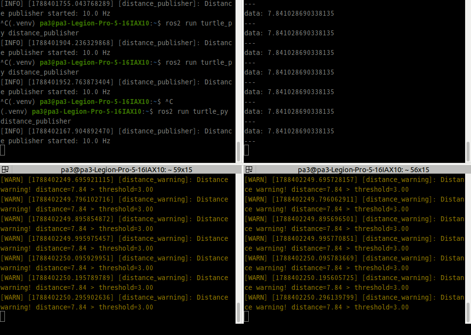
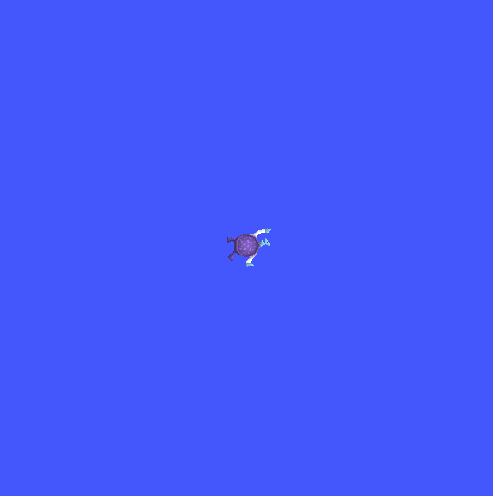
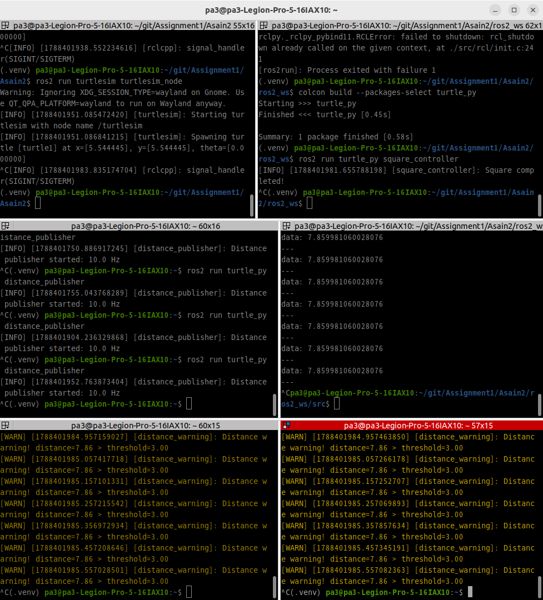
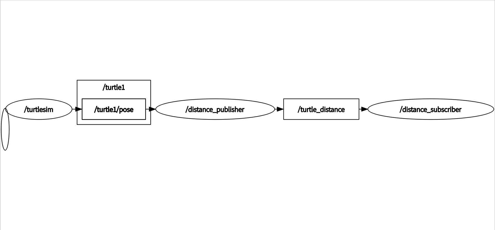
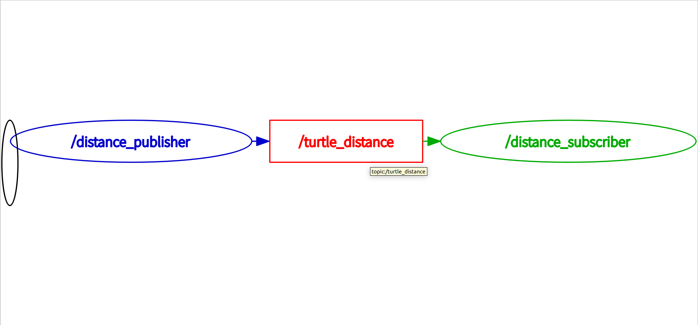
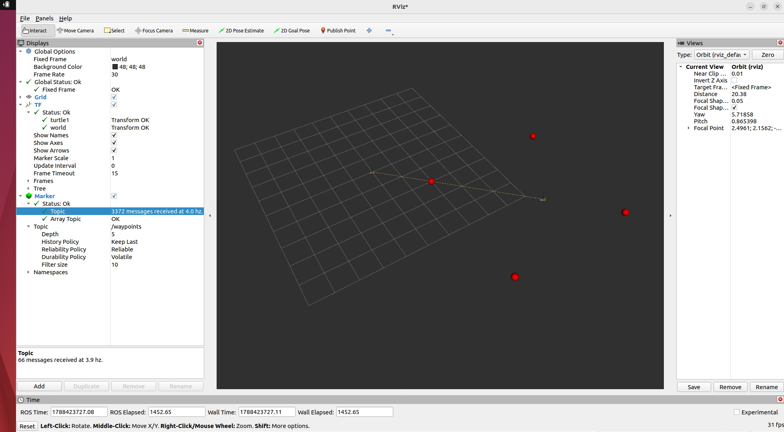
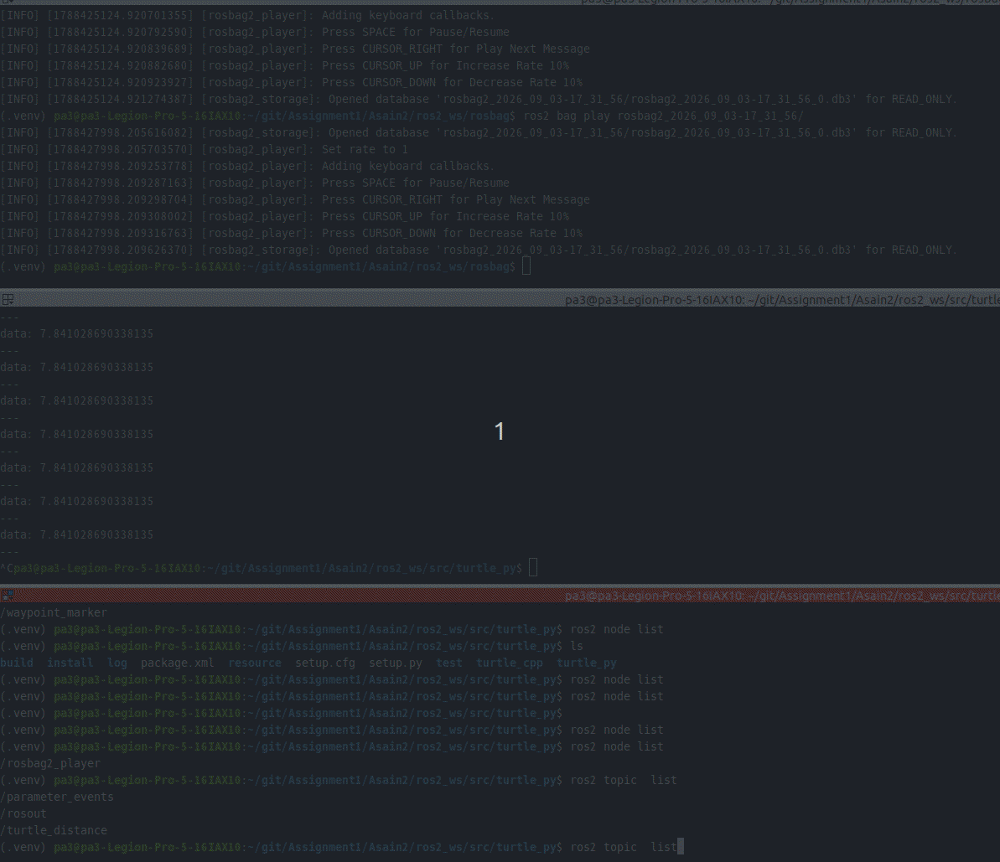

# 과제 2

## 문제 1
  
### 1. 수동 2단계 빌드 명령 (터미널 입력)

```console
g++ -Wall -std=c++17 -c motor.cpp -o motor.o
g++ -Wall -std=c++17 -c main.cpp -o main.o

g++ motor.o main.o -o motor_test
./motor_test

Motor speed: 50
```

### 2. undefined reference 에러 메시지 (출력) — 컴파일 에러와의 차이 설명

링크 에러

```console
pa3@pa3-Legion-Pro-5-16IAX10:~/git/Assignment1/Asain2/cpp_basics$ g++ main.o -o motor_test
/usr/bin/ld: main.o: in function `main':
main.cpp:(.text+0x24): undefined reference to `Motor::Motor()'
/usr/bin/ld: main.cpp:(.text+0x35): undefined reference to `Motor::setSpeed(int)'
/usr/bin/ld: main.cpp:(.text+0x5d): undefined reference to `Motor::getSpeed() const'
collect2: error: ld returned 1 exit status
```

컴파일 에러 

```console
pa3@pa3-Legion-Pro-5-16IAX10:~/git/Assignment1/Asain2/cpp_basics$ g++ -Wall -std=c++17 -c motor.cpp -o motor.o
motor.cpp:7:2: error: stray ‘`’ in program
    7 | 1`
      |  ^
motor.cpp:7:1: error: expected unqualified-id before numeric constant
    7 | 1`
      | ^
```

차이점 : 컴파일 에러는 클래스 코드 내에 문제가 있어서, 컴파일이 되는 순간 에러가 발생한다.
         링크 에러는 오브젝트 연결 시 참조가 부족한 클래스를 연결할 때 에러가 발생한다. 

### 3. CMake 빌드 출력 (터미널 출력)

```console
pa3@pa3-Legion-Pro-5-16IAX10:~/git/Assignment1/Asain2/cpp_basics/build$ cmake ..
-- The C compiler identification is GNU 11.4.0
-- The CXX compiler identification is GNU 11.4.0
-- Detecting C compiler ABI info
-- Detecting C compiler ABI info - done
-- Check for working C compiler: /usr/bin/cc - skipped
-- Detecting C compile features
-- Detecting C compile features - done
-- Detecting CXX compiler ABI info
-- Detecting CXX compiler ABI info - done
-- Check for working CXX compiler: /usr/bin/c++ - skipped
-- Detecting CXX compile features
-- Detecting CXX compile features - done
-- Configuring done
-- Generating done
-- Build files have been written to: /home/pa3/git/Assignment1/Asain2/cpp_basics/build

pa3@pa3-Legion-Pro-5-16IAX10:~/git/Assignment1/Asain2/cpp_basics/build$ make
[ 33%] Building CXX object CMakeFiles/motor_test.dir/main.cpp.o
[ 66%] Building CXX object CMakeFiles/motor_test.dir/motor.cpp.o
[100%] Linking CXX executable motor_test
[100%] Built target motor_test

```


### 4. 증분 빌드 시 재컴파일된 파일: ___ — 판단 근거

```console
pa3@pa3-Legion-Pro-5-16IAX10:~/git/Assignment1/Asain2/cpp_basics/build$ make
Consolidate compiler generated dependencies of target motor_test
[ 33%] Building CXX object CMakeFiles/motor_test.dir/motor.cpp.o
[ 66%] Linking CXX executable motor_test
[100%] Built target motor_test
```

- 재컴파일 된 파일 : motor.cpp.o
- 증분 빌드 근거: 마지막 빌드 이후 변경된 소스 코드와 그에 영향을 받는 부분만 골라서 다시 빌드를 수행함


## 문제 2
### 1. 다형성 루프 출력

```console
===== 다형성 Test =====
Lidar Constructor
Imu Constructor
[Lidar] Lidar : reading distance data
[Imu] Imu : reading distance data

```

### 2. 스택 객체와 힙 객체의 소멸 시점 — 관찰 로그와 설명
```console
===== 객체 생성 =====
Lidar 생성
Imu 생성

===== 객체 사용 =====
Lidar : reading distance data
Imu : reading distance data

===== 객체 소멸 직전 =====
Imu 소멸
Sensor destructor
Lidar 소멸
Sensor destructor
```

   설명 : Lidar는 스택에 생성되어 스코프가 끝날 때 소멸하고, Imu는 힙에 생성되어 unique_ptr가 소유·관리한다. 두 객체가 같은 스코프에 있으므로 스코프 종료 시 소멸하며, Imu가 먼저 소멸하는 것은 힙이기 때문이 아니라 생성 순서의 역순으로 소멸하기 때문이다.

### 3. 가상 소멸자를 뺐을 때의 차이: ___

가상 소멸자를 제거하면 부모 클래스 타입으로 파생 객체를 삭제할 때 파생 클래스의 소멸자가 호출되지 않아, 
파생 객체가 보유한 자원이 제대로 해제되지 않을 수 있다.

### 4. count_if 결과: 0.5 이내 기록 ___ 개
```console
===== count_if Test =====
0.5 이내의 측정 기록: 3개
```

### 5. 누수 검출 결과 → 수정 후 결과 (검출 도구 출력 비교)

- 누수 검출 결과
  
```console
pa3@pa3-Legion-Pro-5-16IAX10:~/git/Assignment1/Asain2/cpp_basics/sensors$ g++ -std=c++17 -fsanitize=address -g *.cpp -o main
pa3@pa3-Legion-Pro-5-16IAX10:~/git/Assignment1/Asain2/cpp_basics/sensors$ ./main
===== 다형성 Test =====
Lidar 생성
Imu 생성
[Lidar] Lidar : reading distance data
[Imu] Imu : reading distance data

===== 객체 생성 =====
Lidar 생성
Imu 생성

===== 객체 사용 =====
Lidar : reading distance data
Imu : reading distance data

===== 객체 소멸 직전 =====
Imu 소멸
Sensor destructor
Lidar 소멸
Sensor destructor

===== unordered_map Test =====
Latest Lidar: (1, 2)
Latest Imu: (0.2, 0.3)

===== count_if Test =====
0.5 이내의 측정 기록: 3개

===== clamp Test =====
속도: 15.5 -> 10
픽셀: 300 -> 255

===== Memory Leak Test =====
Lidar 생성
Memory leak test finished.
Lidar 소멸
Sensor destructor
Imu 소멸
Sensor destructor

=================================================================
==27556==ERROR: LeakSanitizer: detected memory leaks

Direct leak of 8 byte(s) in 1 object(s) allocated from:
    #0 0x7a8cb06b61e7 in operator new(unsigned long) ../../../../src/libsanitizer/asan/asan_new_delete.cpp:99
    #1 0x649dd425ba22 in memoryLeak() /home/pa3/git/Assignment1/Asain2/cpp_basics/sensors/main.cpp:62
    #2 0x649dd425d168 in main /home/pa3/git/Assignment1/Asain2/cpp_basics/sensors/main.cpp:200
    #3 0x7a8cafe29d8f in __libc_start_call_main ../sysdeps/nptl/libc_start_call_main.h:58

SUMMARY: AddressSanitizer: 8 byte(s) leaked in 1 allocation(s).
```

- 수정 후 결과
  
```console
pa3@pa3-Legion-Pro-5-16IAX10:~/git/Assignment1/Asain2/cpp_basics/sensors$ g++ -std=c++17 -fsanitize=address -g *.cpp -o main
pa3@pa3-Legion-Pro-5-16IAX10:~/git/Assignment1/Asain2/cpp_basics/sensors$ ./main
===== 다형성 Test =====
Lidar 생성
Imu 생성
[Lidar] Lidar : reading distance data
[Imu] Imu : reading distance data

===== 객체 생성 =====
Lidar 생성
Imu 생성

===== 객체 사용 =====
Lidar : reading distance data
Imu : reading distance data

===== 객체 소멸 직전 =====
Imu 소멸
Sensor destructor
Lidar 소멸
Sensor destructor

===== unordered_map Test =====
Latest Lidar: (1, 2)
Latest Imu: (0.2, 0.3)

===== count_if Test =====
0.5 이내의 측정 기록: 3개

===== clamp Test =====
속도: 15.5 -> 10
픽셀: 300 -> 255

===== make_unique Test =====
Lidar 생성
make_unique test finished.
Lidar 소멸
Sensor destructor
Lidar 소멸
Sensor destructor
Imu 소멸
Sensor destructor
```

## 문제 3
### 1. /turtle1/pose 필드 구성: ___
```console
x: 5.544444561004639
y: 5.544444561004639
theta: 0.0
linear_velocity: 0.0
angular_velocity: 0.0

- x, = 거북이 x 좌표
- y  = 거북이 y 좌표
- theta = 거북이 좌표
- linear_velocity = 선속도
- angular_velocity = 각속도
```

### 2. ros2 topic hz /turtle_distance 출력: 평균 ___ Hz
```console
average rate: 10.000Hz
min: 0.100s max: 0.100s std dev: 0.00014s window: 12
```

### 3. 구독자 경고 로그 (터미널 출력)
```console
[WARN] [1787907483.947893046] [distance_warning]: Distance warning! distance=7.84 > threshold=3.00
[WARN] [1787907483.971045460] [distance_warning]: Distance warning! distance=7.84 > threshold=3.00
[WARN] [1787907484.048103758] [distance_warning]: Distance warning! distance=7.84 > threshold=3.00
[WARN] [1787907484.071057056] [distance_warning]: Distance warning! distance=7.84 > threshold=3.00
[WARN] [1787907484.148298229] [distance_warning]: Distance warning! distance=7.84 > threshold=3.00
[WARN] [1787907484.171090302] [distance_warning]: Distance warning! distance=7.84 > threshold=3.00
[WARN] [1787907484.248611083] [distance_warning]: Distance warning! distance=7.84 > threshold=3.00
[WARN] [1787907484.271324815] [distance_warning]: Distance warning! distance=7.84 > threshold=3.00
[WARN] [1787907484.348391985] [distance_warning]: Distance warning! distance=7.84 > threshold=3.00
[WARN] [1787907484.371093354] [distance_warning]: Distance warning! distance=7.84 > threshold=3.00
[WARN] [1787907484.448524008] [distance_warning]: Distance warning! distance=7.84 > threshold=3.00
[WARN] [1787907484.470952226] [distance_warning]: Distance warning! distance=7.84 > threshold=3.00
[WARN] [1787907484.548324302] [distance_warning]: Distance warning! distance=7.84 > threshold=3.00
[WARN] [1787907484.570835062] [distance_warning]: Distance warning! distance=7.84 > threshold=3.00
[WARN] [1787907484.648629573] [distance_warning]: Distance warning! distance=7.84 > threshold=3.00
[WARN] [1787907484.671014735] [distance_warning]: Distance warning! distance=7.84 > threshold=3.00
```

### 4. 구독자 2개 동시 수신 확인 (양쪽 로그)


### 5. 정사각형 주행 캡처 (turtlesim 화면)


### 6. Ctrl+C 정상 종료 화면 (출력)


### 문제 4

### 1. colcon build 성공 출력

```console
pa3@pa3-Legion-Pro-5-16IAX10:~/git/Assignment1/Asain2/ros2_ws/src/turtle_cpp$ colcon build --packages-select turtle_cpp
Starting >>> turtle_cpp
Finished <<< turtle_cpp [0.98s]                

Summary: 1 package finished [1.11s]

```

### 2. rclpy 발행에서 rclcpp 구독으로 이어진 로그

- rclpy (Publisher)
```console
(.venv) pa3@pa3-Legion-Pro-5-16IAX10:~/git/Assignment1/Asain2/ros2_ws$ ros2 run turtle_py distance_publisher
[INFO] [1788408059.745286674] [distance_publisher]: Distance publisher started: 10.0 Hz
[INFO] [1788408059.836585628] [distance_publisher]: [rclpy Publisher] Publishing distance: 0.00
[INFO] [1788408059.936632279] [distance_publisher]: [rclpy Publisher] Publishing distance: 0.00
[INFO] [1788408060.036816155] [distance_publisher]: [rclpy Publisher] Publishing distance: 0.00
[INFO] [1788408060.136646377] [distance_publisher]: [rclpy Publisher] Publishing distance: 0.00
[INFO] [1788408060.236671057] [distance_publisher]: [rclpy Publisher] Publishing distance: 0.00
[INFO] [1788408060.336664520] [distance_publisher]: [rclpy Publisher] Publishing distance: 0.00
[INFO] [1788408060.436620032] [distance_publisher]: [rclpy Publisher] Publishing distance: 0.00
^C(.venv) pa3@pa3-Legion-Pro-5-16IAX10:~/git/Assignment1/Asain2/ros2_ws$ 

```

- rclcpp (Subsciber)
```console
pa3@pa3-Legion-Pro-5-16IAX10:~/git/Assignment1/Asain2/ros2_ws$ ros2 run turtle_cpp distance_subscriber
[INFO] [1788408054.346263758] [distance_subscriber]: Distance subscriber started
[INFO] [1788408059.836719236] [distance_subscriber]: [rclcpp Subscriber] Received distance: 0.00
[INFO] [1788408059.936731816] [distance_subscriber]: [rclcpp Subscriber] Received distance: 0.00
[INFO] [1788408060.036930357] [distance_subscriber]: [rclcpp Subscriber] Received distance: 0.00
[INFO] [1788408060.136763193] [distance_subscriber]: [rclcpp Subscriber] Received distance: 0.00
[INFO] [1788408060.236783879] [distance_subscriber]: [rclcpp Subscriber] Received distance: 0.00
[INFO] [1788408060.336713694] [distance_subscriber]: [rclcpp Subscriber] Received distance: 0.00
[INFO] [1788408060.436732754] [distance_subscriber]: [rclcpp Subscriber] Received distance: 0.00
^C[INFO] [1788408060.992775698] [rclcpp]: signal_handler(SIGINT/SIGTERM)

```
### 3. rclpy와 rclcpp 대응 관계표 — 노드 생성 / 타이머 / 콜백 / 종료 (4행)

| 구분 | rclpy (Python) | rclcpp (C++) |
|---|---|---|
| 노드 생성 | `super().__init__('distance_publisher')` | `Node("distance_publisher")` |
| 타이머 | `self.create_timer(timer_period, self.timer_callback)` | `this->create_wall_timer(timer_period, std::bind(...))` |
| 콜백 | `def timer_callback(self):` | `void timer_callback()` |
| 종료 | `rclpy.shutdown()` | `rclcpp::shutdown()` |

## 문제 10
### 1. rqt_graph 캡처 — 데이터 미수신 진단 절차 (단계별)

#### 정상


#### 강제 종료



#### 데이터 미수신 진단 절차

`/turtle_distance`의 데이터가 수신되지 않을 경우 다음 순서로 원인을 확인한다.

1. **노드 실행 여부 확인**

```console
   ros2 node list
   ```

   필요한 Publisher와 Subscriber 노드가 실행 중인지 확인한다.

2. **토픽 존재 여부 확인**

```console
   ros2 topic list
   ```

   `/turtle1/pose`와 `/turtle_distance` 토픽이 존재하는지 확인한다.

3. **Publisher / Subscriber 연결 확인**

```console
   ros2 topic info /turtle_distance
   ```

   Publisher와 Subscriber의 개수를 확인하여 토픽 연결 상태를 확인한다.

4. **실제 메시지 수신 여부 확인**

```console
   ros2 topic echo /turtle_distance
   ```

   메시지가 실제로 전달되고 있는지 확인한다.

5. **발행 주기 확인**

```console
   ros2 topic hz /turtle_distance
   ```

   정상 상태에서는 약 10 Hz로 데이터가 발행되는지 확인한다.
   turtlesim을 종료하면 `/turtle1/pose`가 더 이상 발행되지 않으므로 거리 계산 노드의 `/turtle_distance` 데이터도 더 이상 들어오지 않는다.

6. **원본 토픽 확인**

```console
   ros2 topic echo /turtle1/pose
   ```

   원본 데이터가 들어오지 않는 경우 turtlesim 또는 `/turtle1/pose` Publisher를 우선 확인한다.

7. **노드 간 연결 구조 확인**

```console
   rqt_graph
   ```

   노드와 토픽의 연결 관계를 확인하여 어느 구간에서 데이터 흐름이 끊겼는지 판단한다.

따라서 데이터 미수신 시에는 **노드 → 토픽 → Publisher/Subscriber 연결 → 실제 메시지 → 발행 주기 → 원본 토픽 → 전체 그래프** 순서로 확인하면 문제 발생 지점을 단계적으로 좁힐 수 있다.


### 2. RViz2 TF + 경유점 마커 캡처


### 3. ros2 bag play 재생 중 구독자 로그 — 기록된 토픽과 메시지 수: ___


- Messages:          3745
- Topic information: </br>
   Topic: /turtle_distance | Type: std_msgs/msg/Float32 | Count: 513 | Serialization Format: cdr </br>
   Topic: /turtle1/<strong>pose | Type: turtlesim/msg/Pose | Count: 3232 | Serialization Format: cdr

### 4. pytest 통과 출력 — 작성한 테스트 3개의 의도

- pytest 통과 출력

```console
(.venv) pa3@pa3-Legion-Pro-5-16IAX10:~/git/Assignment1/Asain2/ros2_ws/src/turtle_py/turtle_py$ pytest test_calculations.py -v
============================================================================================================ test session starts =============================================================================================================
platform linux -- Python 3.10.12, pytest-8.4.2, pluggy-1.6.0 -- /home/pa3/.venv/bin/python
cachedir: .pytest_cache
rootdir: /home/pa3/git/Assignment1/Asain2/ros2_ws/src/turtle_py
plugins: ament-xmllint-0.12.15, ament-lint-0.12.15, ament-copyright-0.12.15, launch-testing-1.0.14, ament-pep257-0.12.15, ament-flake8-0.12.15, launch-testing-ros-0.19.14, anyio-4.14.2
collected 9 items                                                                                                                                                                                                                            

test_calculations.py::TestCalculateDistance::test_normal PASSED                                                                                                                                                                        [ 11%]
test_calculations.py::TestCalculateDistance::test_boundary PASSED           pytest 통과 출력                                                                                                                                                           [ 22%]
test_calculations.py::TestCalculateDistance::test_exception PASSED                                                                                                                                                                     [ 33%]
test_calculations.py::TestAngleToGoal::test_normal PASSED                                                                                                                                                                              [ 44%]
test_calculations.py::TestAngleToGoal::test_boundary PASSED                                                                                                                                                                            [ 55%]
test_calculations.py::TestAngleToGoal::test_exception PASSED                                                                                                                                                                           [ 66%]
test_calculations.py::TestWaypointReached::test_normal PASSED                                                                                                                                                                          [ 77%]
test_calculations.py::TestWaypointReached::test_boundary PASSED                                                                                                                                                                        [ 88%]
test_calculations.py::TestWaypointReached::test_exception PASSED                                                                                                                                                                       [100%]

============================================================================================================= 9 passed in 0.18s ==============================================================================================================
```

- 작성한 테스트 3개의 의도</br>
pytest를 통해 거리 계산, 목표 방향각 계산, 경유점 도달 판정의 정상 입력·경계값·예외 상황을 각각 검증하였다.

- <strong>목표까지의 거리 계산 테스트</strong> </br>
현재 위치 (x, y)에서 원점까지의 거리를 올바르게 계산하는지 확인한다.</br>
정상적인 3-4-5 삼각형 입력과 원점 (0, 0)이라는 경계값을 검증하고, 숫자가 아닌 입력이 들어왔을 때 예외가 발생하는지도 확인한다.</br>

- <strong>목표를 향한 각도 계산 테스트</strong></br>
atan2를 이용해 현재 위치에서 목표 위치까지의 방향각을 올바르게 계산하고, 결과가 -π ~ π 범위로 정규화되는지 확인한다.</br>
일반적인 대각선 방향과 π 경계 방향을 검증하고, 잘못된 입력에 대한 예외 처리도 확인한다.</br>

- <strong>경유점 도달 판정 테스트</strong></br>
현재 위치와 경유점 사이의 거리를 기준으로 허용 오차 내에 도달했는지를 올바르게 판정하는지 확인한다.</br>
정상적으로 허용 오차 안에 있는 경우와 거리가 허용 오차와 정확히 같은 경계값을 검증하고,</br>
 음수 허용 오차가 입력되었을 때 예외가 발생하는지 확인한다.</br>


### 5. 함수를 틀리게 바꿨을 때 실패 출력

```console
(.venv) pa3@pa3-Legion-Pro-5-16IAX10:~/git/Assignment1/Asain2/ros2_ws/src/turtle_py/turtle_py$ pytest test_calculations.py -v
============================================================================================================ test session starts =============================================================================================================
platform linux -- Python 3.10.12, pytest-8.4.2, pluggy-1.6.0 -- /home/pa3/.venv/bin/python
cachedir: .pytest_cache
rootdir: /home/pa3/git/Assignment1/Asain2/ros2_ws/src/turtle_py
plugins: ament-xmllint-0.12.15, ament-lint-0.12.15, ament-copyright-0.12.15, launch-testing-1.0.14, ament-pep257-0.12.15, ament-flake8-0.12.15, launch-testing-ros-0.19.14, anyio-4.14.2
collected 0 items / 1 error                                                                                                                                                                                                                  

=================================================================================================================== ERRORS ===================================================================================================================
______________________________________________________________________________________________ ERROR collecting turtle_py/test_calculations.py _______________________________________________________________________________________________
/home/pa3/.venv/lib/python3.10/site-packages/_pytest/python.py:498: in importtestmodule
    mod = import_path(
/home/pa3/.venv/lib/python3.10/site-packages/_pytest/pathlib.py:587: in import_path
    importlib.import_module(module_name)
/usr/lib/python3.10/importlib/__init__.py:126: in import_module
    return _bootstrap._gcd_import(name[level:], package, level)
<frozen importlib._bootstrap>:1050: in _gcd_import
    ???
<frozen importlib._bootstrap>:1027: in _find_and_load
    ???
<frozen importlib._bootstrap>:1006: in _find_and_load_unlocked
    ???
<frozen importlib._bootstrap>:688: in _load_unlocked
    ???
/home/pa3/.venv/lib/python3.10/site-packages/_pytest/assertion/rewrite.py:186: in exec_module
    exec(co, module.__dict__)
test_calculations.py:6: in <module>
    from turtle_py.square_controller import SquareController
E     File "/home/pa3/git/Assignment1/Asain2/ros2_ws/src/turtle_py/turtle_py/square_controller.py", line 70
E       goal_y - y,ㄴ
E                  
E   SyntaxError: invalid syntax. Perhaps you forgot a comma?
========================================================================================================== short test summary info ===========================================================================================================
ERROR test_calculations.py
!!!!!!!!!!!!!!!!!!!!!!!!!!!!!!!!!!!!!!!!!!!!!!!!!!!!!!!!!!!!!!!!!!!!!!!!!!!!!!!!!!!!!!!!!!!!!!!!!!! Interrupted: 1 error during collection !!!!!!!!!!!!!!!!!!!!!!!!!!!!!!!!!!!!!!!!!!!!!!!!!!!!!!!!!!!!!!!!!!!!!!!!!!!!!!!!!!!!!!!!!!!!!!!!!!!
============================================================================================================== 1 error in 0.23s ==============================================================================================================
```

### 6. 예외 처리·logging 동작 확인: ___

- 잘못된 인수값 전달 시, 예외처리 후 정상동작  
```console
(.venv) pa3@pa3-Legion-Pro-5-16IAX10:~$ ros2 run turtle_py distance_publisher --ros-args -p publish_rate:=0.0
[WARN] [1788434104.079047413] [distance_publisher]: Invalid publish_rate: 0.0. publish_rate must be greater than 0. Using 10.0 Hz instead.
[INFO] [1788434104.081087667] [distance_publisher]: Distance publisher started: 10.0 Hz
[INFO] [1788434104.181175787] [distance_publisher]: [rclpy Publisher] Publishing distance: 0.00
[INFO] [1788434104.281223277] [distance_publisher]: [rclpy Publisher] Publishing distance: 0.00
[INFO] [1788434104.381214736] [distance_publisher]: [rclpy Publisher] Publishing distance: 0.00
[INFO] [1788434104.481241141] [distance_publisher]: [rclpy Publisher] Publishing distance: 0.00
[INFO] [1788434104.581119839] [distance_publisher]: [rclpy Publisher] Publishing distance: 0.00
[INFO] [1788434104.681126667] [distance_publisher]: [rclpy Publisher] Publishing distance: 0.00
[INFO] [1788434104.781119234] [distance_publisher]: [rclpy Publisher] Publishing distance: 0.00
[INFO] [1788434104.881270551] [distance_publisher]: [rclpy Publisher] Publishing distance: 0.00
[INFO] [1788434104.981210541] [distance_publisher]: [rclpy Publisher] Publishing distance: 0.00
[INFO] [1788434105.081239054] [distance_publisher]: [rclpy Publisher] Publishing distance: 0.00
[INFO] [1788434105.181265670] [distance_publisher]: [rclpy Publisher] Publishing distance: 0.00
[INFO] [1788434105.281209449] [distance_publisher]: [rclpy Publisher] Publishing distance: 0.00
[INFO] [1788434105.381120122] [distance_publisher]: [rclpy Publisher] Publishing distance: 0.00

```
