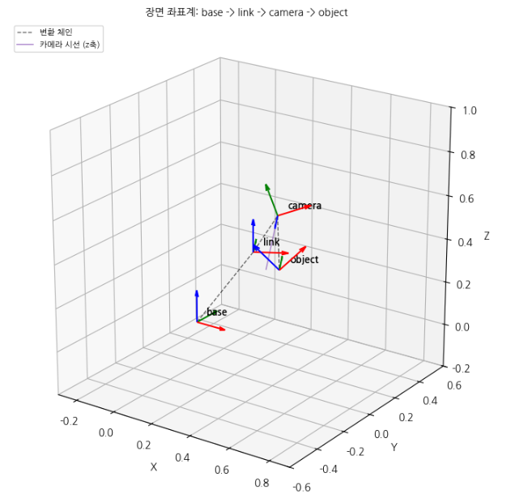

# 1. 프로젝트 환경 구성과 장면 좌표계 모델링

## 1) 커널 확인 출력 — 인터프리터 경로: ___
<strong> (1) 인터프리터 경로 </strong>

/home/pa3/git/Assignment1/lv1_module4/.venv/bin/python

</br>

## 2) 셀 실행 순서 실험 — 관찰한 현상과 그 이유
<strong> (1) 단계별 출력</strong> 
- 1단계 출력: 최종 count = 1 
- 2단계 출력: 최종 count = 3 
- 3단계 오류: NameError: name 'count' is not defined 

</br>

<strong> (2) 이유</strong> 

커널을 재시작하면 기존 변수들이 초기화되므로, count가 정의되지 않은 상태(1단계 미실행)에서 C 셀을 실행하면 NameError가 발생한다.
그러므로, 제출 전 Restart & Run All 을 해주어 셀을 위에서 부터 순서대로 실행함으로써 코드가 정상적으로 동작하는지 검증 결과가 올바른지 확인해야한다. 

</br>

## 3) 네 좌표계 3D 시각화 (이미지)


## 4) requirements.txt 내용 (파일 내용)
```bash
ackermann-msgs==2.0.2
action-msgs==1.2.3
action-tutorials-interfaces==0.20.9
action-tutorials-py==0.20.9
actionlib-msgs==4.9.2
ament-cmake-test==1.3.14
ament-copyright==0.12.15
ament-cppcheck==0.12.15
ament-cpplint==0.12.15
ament-flake8==0.12.15
ament-index-python==1.4.1
ament-lint==0.12.15
ament-lint-cmake==0.12.15
ament-package==0.14.2
ament-pep257==0.12.15
ament-uncrustify==0.12.15
ament-xmllint==0.12.15
angles==1.15.0
anyio==4.15.1
argon2-cffi==25.1.0
argon2-cffi-bindings==26.1.0
arrow==1.4.0
asttokens==3.0.2
async-lru==2.3.0
attrs==26.1.0
babel==2.18.0
beautifulsoup4==4.15.0
bleach==6.4.0
bond==4.1.4
builtin-interfaces==1.2.3
cartographer-ros-msgs==2.0.9002
certifi==2026.7.22
cffi==2.1.1
charset-normalizer==3.5.1
comm==0.2.3
composition-interfaces==1.2.3
contourpy==1.3.2
control-msgs==4.9.0
controller-manager==2.54.0
controller-manager-msgs==2.54.0
cv-bridge==3.2.1
cycler==0.12.1
debugpy==1.8.21
decorator==5.3.1
defusedxml==0.7.1
demo-nodes-py==0.20.9
diagnostic-msgs==4.9.2
diagnostic-updater==4.0.7
domain-coordinator==0.10.0
dwb-msgs==1.1.20
example-interfaces==0.9.3
examples-rclpy-executors==0.15.5
examples-rclpy-minimal-action-client==0.15.5
examples-rclpy-minimal-action-server==0.15.5
examples-rclpy-minimal-client==0.15.5
examples-rclpy-minimal-publisher==0.15.5
examples-rclpy-minimal-service==0.15.5
examples-rclpy-minimal-subscriber==0.15.5
exceptiongroup==1.3.1
executing==2.2.1
fastjsonschema==2.22.2
fonttools==4.64.0
fqdn==1.5.1
gazebo-model-attachment-plugin==1.0.3
gazebo-model-attachment-plugin-msgs==1.0.3
gazebo-msgs==3.9.0
gazebo-video-monitor-interfaces==0.8.1
gazebo-video-monitor-utils==0.8.1
generate-parameter-library-py==0.7.5
geometry-msgs==4.9.2
h11==0.16.0
httpcore==1.0.9
httpx==0.28.1
idna==3.19
image-geometry==3.2.1
ImageIO==2.37.4
iniconfig==2.3.0
interactive-markers==2.3.2
ipykernel==7.3.0
ipython==8.39.0
isoduration==20.11.0
jedi==0.20.0
Jinja2==3.1.6
joint-state-publisher==2.4.0
joint-state-publisher-gui==2.4.0
json5==0.15.0
jsonpointer==3.1.1
jsonschema==4.26.0
jsonschema-specifications==2025.9.1
jupyter-events==0.12.1
jupyter-lsp==2.3.1
jupyter_builder==1.2.3
jupyter_client==8.10.0
jupyter_core==5.9.1
jupyter_server==2.21.0
jupyter_server_terminals==0.5.4
jupyterlab==4.6.3
jupyterlab_pygments==0.3.0
jupyterlab_server==2.28.0
kiwisolver==1.5.1
lark==1.3.1
laser-geometry==2.4.1
launch==1.0.14
launch-ros==0.19.14
launch-testing==1.0.14
launch-testing-ros==0.19.14
launch-xml==1.0.14
launch-yaml==1.0.14
lifecycle-msgs==1.2.3
logging-demo==0.20.9
map-msgs==2.1.0
MarkupSafe==3.0.3
matplotlib==3.10.9
matplotlib-inline==0.2.2
message-filters==4.3.19
mistune==3.3.4
nav-2d-msgs==1.1.20
nav-msgs==4.9.2
nav2-common==1.1.20
nav2-msgs==1.1.20
nav2-simple-commander==1.0.0
nbclient==0.11.0
nbconvert==7.17.1
nbformat==5.11.1
nest-asyncio2==1.7.2
notebook_shim==0.2.4
numpy==2.2.6
osrf-pycommon==2.1.6
overrides==7.7.0
packaging==26.3
pandocfilters==1.5.1
parso==0.8.7
pcl-msgs==1.0.0
pendulum-msgs==0.20.9
pexpect==4.9.0
pillow==12.3.0
platformdirs==4.11.7
pluggy==1.6.0
prometheus_client==0.26.0
prompt_toolkit==3.0.53
psutil==7.2.2
ptyprocess==0.7.0
pure_eval==0.2.3
pycparser==3.0
Pygments==2.21.0
pyparsing==3.3.2
pytest==9.1.1
python-dateutil==2.9.0.post0
python-json-logger==4.2.0
python-qt-binding==1.1.3
PyYAML==6.0.3
pyzmq==27.2.0
qt-dotgraph==2.2.5
qt-gui==2.2.5
qt-gui-cpp==2.2.5
qt-gui-py-common==2.2.5
quality-of-service-demo-py==0.20.9
rcl-interfaces==1.2.3
rclpy==3.3.21
rcutils==5.1.9
referencing==0.37.0
requests==2.34.2
resource-retriever==3.1.3
rfc3339-validator==0.1.4
rfc3986-validator==0.1.1
rfc3987-syntax==1.1.0
rmw-dds-common==1.6.0
ros2action==0.18.19
ros2bag==0.15.16
ros2cli==0.18.19
ros2component==0.18.19
ros2controlcli==2.54.0
ros2doctor==0.18.19
ros2interface==0.18.19
ros2launch==0.19.14
ros2lifecycle==0.18.19
ros2multicast==0.18.19
ros2node==0.18.19
ros2param==0.18.19
ros2pkg==0.18.19
ros2plugin==5.1.4
ros2run==0.18.19
ros2service==0.18.19
ros2topic==0.18.19
rosbag2-interfaces==0.15.16
rosbag2-py==0.15.16
rosgraph-msgs==1.2.3
rosidl-adapter==3.1.9
rosidl-cli==3.1.9
rosidl-cmake==3.1.9
rosidl-generator-c==3.1.9
rosidl-generator-cpp==3.1.9
rosidl-generator-py==0.14.6
rosidl-generator-rs==0.4.12
rosidl-parser==3.1.9
rosidl-runtime-py==0.9.3
rosidl-typesupport-c==2.0.2
rosidl-typesupport-cpp==2.0.2
rosidl-typesupport-fastrtps-c==2.2.4
rosidl-typesupport-fastrtps-cpp==2.2.4
rosidl-typesupport-introspection-c==3.1.9
rosidl-typesupport-introspection-cpp==3.1.9
rpds-py==0.30.0
rpyutils==0.2.2
rqt-action==2.0.1
rqt-bag==1.1.6
rqt-bag-plugins==1.1.6
rqt-console==2.0.3
rqt-graph==1.3.2
rqt-gui==1.1.9
rqt-gui-py==1.1.9
rqt-msg==1.2.1
rqt-plot==1.1.5
rqt-publisher==1.5.0
rqt-py-common==1.1.9
rqt-py-console==1.0.2
rqt-reconfigure==1.1.4
rqt-service-caller==1.0.5
rqt-shell==1.0.2
rqt-srv==1.0.3
rqt-topic==1.5.1
scipy==1.15.3
scripts==3.9.0
Send2Trash==2.1.0
sensor-msgs==4.9.2
sensor-msgs-py==4.9.2
shape-msgs==4.9.2
six==1.17.0
slam-toolbox==2.6.10
smclib==4.1.4
soupsieve==2.9.2
sros2==0.10.9
stack-data==0.6.3
statistics-msgs==1.2.3
std-msgs==4.9.2
std-srvs==4.9.2
stereo-msgs==4.9.2
teleop-twist-keyboard==2.4.1
terminado==0.18.1
tf2-geometry-msgs==0.25.22
tf2-kdl==0.25.22
tf2-msgs==0.25.22
tf2-py==0.25.22
tf2-ros-py==0.25.22
tf2-sensor-msgs==0.25.22
tf2-tools==0.25.22
tinycss2==1.5.1
tomli==2.4.1
topic-monitor==0.20.9
tornado==6.5.8
traitlets==5.16.1
trajectory-msgs==4.9.2
turtlesim==1.4.3
typing_extensions==4.16.0
tzdata==2026.3
unique-identifier-msgs==2.2.1
uri-template==1.3.0
urllib3==2.7.0
visualization-msgs==4.9.2
wcwidth==0.8.3
webcolors==25.10.0
webencodings==0.6.1
websocket-client==1.9.2
xacro==2.1.1
```
