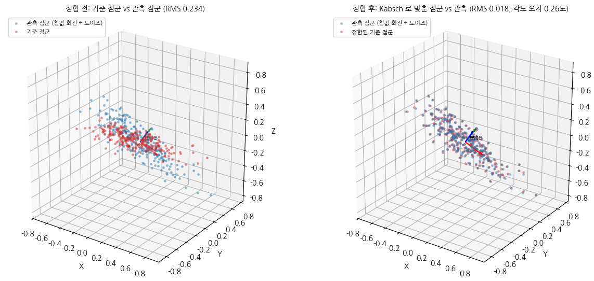
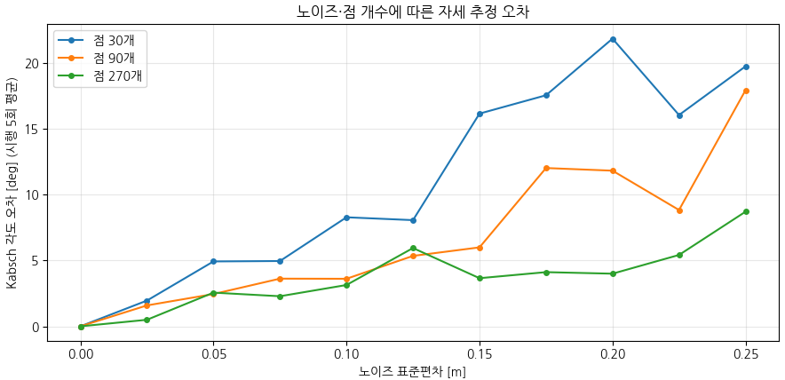
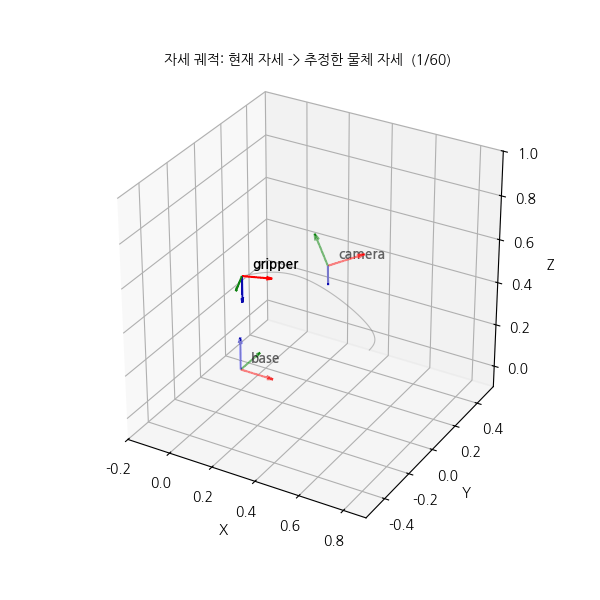

# 모듈 ④ 발표 자료 — 픽앤플레이스 자세 추정#과 궤적 생성

> 이름: `이창엽` / 제출일: `26.09.11`

---

## 1. 파이프라인 전체 구조

### 1) 좌표계 체인 (base -> link -> camera -> object) 그림 또는 다이어그램:
  `base → link → camera → object` 좌표계 체인을 구성하고, 각 변환행렬을 이용하여 카메라에서 측정한 점군을 base 좌표계로 변환하였다.

### 2) 각 노트북·모듈이 맡는 역할 (01 파이프라인 / 02 보간 / 03 자세 추정·시연):
  - `01 파이프라인`에서는 좌표계 변환과 로봇-카메라 관계를 구성 
  - `02 보간`에서는 선형 보간·큐빅 스플라인·5차 다항식 궤적을 구현
  - `03 자세 추정·시연`에서는 PCA/Kabsch를 이용한 자세 추정과 쿼터니언 SLERP 및 최종 픽앤플레이스 궤적을 생성

### 3) 데이터 흐름:
- 카메라 점군 → PosePipeline → base 점군 → PCA/Kabsch → 목표 자세 → SLERP + 스플라인 → 애니메이션`

### 4) 모듈 ③ 에서 가져온 함수와 이번에 새로 만든 함수 구분:
  모듈 ③의 `rot_x`, `rot_y`, `rot_z`, `make_T`, `inv_T`, `transform_points` 등의 좌표변환 함수를 재사용하였다. 이번 모듈에서는 `matrix_to_quaternion`, `quaternion_to_matrix`, `quat_angle`, `slerp`, `lerp_quat`와 `linear_interp`, `cubic_spline_interp`, `finite_diff`, `quintic_profile`, `pca_axes`, `kabsch`, `fit_plane_lstsq`, `remove_outliers` 등을 새로 구현하였다.

## 2. 자세 추정 결과와 오차

### 1) PCA 주축 3개와 고유값:

  ```text
  PCA 주축:
  [[-0.999269  0.037052 -0.009388]
   [ 0.037327  0.998820 -0.031074]
   [ 0.008226 -0.031402 -0.999473]]

  고유값:
  [0.099500 0.010287 0.002548]
  ```

  고유값의 크기가 첫 번째 축에서 가장 크므로 점군의 가장 긴 방향이 첫 번째 주축으로 나타났다.

### 2) Kabsch로 추정한 회전과 참값 사이 각도 오차, 병진 오차
- 각도 오차 : `0.2581711806335743`
- 병진 오차 : `8.710980062440913e-05`

### 3) 이상치 제거 전후 오차
- 2.4157870178912986° → 0.18460078076555608°

  이상치 12개를 제거했으며 실제 이상치 검출률은 `100.0%`였다.

### 4) 정합 전후 그림 (03 노트북 캡처):


## 3. 노이즈·점 개수가 정확도에 미친 영향

### 1) 노이즈 0 ~ 0.25 스윕에서 오차가 어떻게 커졌는가:
  노이즈가 증가할수록 Kabsch 회전 각도 오차가 전반적으로 증가하였다. 
  
  예를 들어 270개 점에서는 노이즈 0에서 약 `0°`였던 오차가 노이즈 0.25에서 약 `8.70°`까지 증가하였다. 점 개수가 적을수록 같은 노이즈에서도 오차가 더 크게 나타났다.

### 2) 점 개수 30 / 90 / 270 계열 비교 — 점이 많을수록 오차가 줄어드는 정도 (대략 몇 배):
점 개수가 증가할수록 평균 각도 오차가 전반적으로 감소하였다. 특히 높은 노이즈 구간에서 `30개 → 270개`로 증가시키면 오차가 대체로 약 `2배 정도` 감소하는 경향을 확인할 수 있었다.

### 3) 구형 점군에서 PCA 주축이 불안정해진 이유 (고유값 관점):
구형 점군은 첫 번째와 두 번째 고유값이 비슷하여 특정 방향이 명확하게 결정되지 않는다. 

실제 고유값 비율은 길쭉한 점군에서 `λ1/λ2 = 12.3718`, 구형 점군에서 `1.1934`였으며, 따라서 구형 점군에서는 작은 노이즈에도 주축 방향이 크게 흔들렸다. 측정된 주축 흔들림은 길쭉한 점군 `2.4810°`, 구형 점군 `72.7293°`였다.

### 4) 오차 그래프 (03 노트북 캡처):


## 4. 현재 구현의 한계

### 1) 자세 추정:
  Kabsch는 점과 점 사이의 대응 관계가 알려져 있어야 하며, PCA는 점군의 형상에 따라 주축이 불안정할 수 있다. 
  
  특히 대칭적인 물체에서는 주축의 방향이나 부호가 모호해질 수 있으며, 이상치가 많은 경우 자세 추정 오차가 증가할 수 있다.

### 2) 궤적 생성:
  현재 구현은 위치에 큐빅 스플라인, 자세에 SLERP를 적용하여 부드러운 궤적을 만들지만 실제 로봇의 관절 한계, 최대 속도·가속도, 토크 제한, 충돌 회피 등을 고려하지 않는다.

### 3) 파이프라인:
  현재는 단순화된 관절 1개 구조를 사용하며 카메라 캘리브레이션 오차, 센서 노이즈 및 로봇의 실제 기구학 오차를 충분히 반영하지 않았다.

### 4) 시연:


## 5. 개선한다면 무엇을 어떻게

### 1) 대응 없는 점군 정합 
ICP 또는 feature-based registration을 적용하여 점-점 대응을 직접 지정하지 않고 두 점군을 정합한다.

### 2) 이상치에 강한 자세 추정 
RANSAC 기반 평면 피팅 및 robust registration을 적용하여 외란이나 센서 이상치의 영향을 줄인다.

### 3) 궤적 생성 개선 
최소 저크 및 시간 최적화 궤적을 적용하고 실제 로봇의 관절 위치·속도·가속도 제한과 충돌 조건을 함께 고려한다.

### 4) 개선 효과를 어떻게 측정할 것인지:
자세 추정 평균/최대 각도 오차, 
병진 오차,
정합 후 RMS 오차,
이상치 검출률, 
궤적의 속도·가속도·저크 최대값, 
계획 성공률 및 계산 시간을 기존 구현과 비교하여 개선 효과를 정량적으로 평가한다.

---

### 부록 — 재현 정보

### Python / 주요 패키지 버전 (`requirements.txt`):
- Python 3.10.x / NumPy / SciPy / pytest`

### 난수 시드:
- np.random.default_rng(42)`

### 세 노트북 Restart Kernel and Run All 통과 여부:
- 최종 전체 재실행 결과 확인 필요`

### `demo.gif` 프레임 수:
- 60 프레임`
